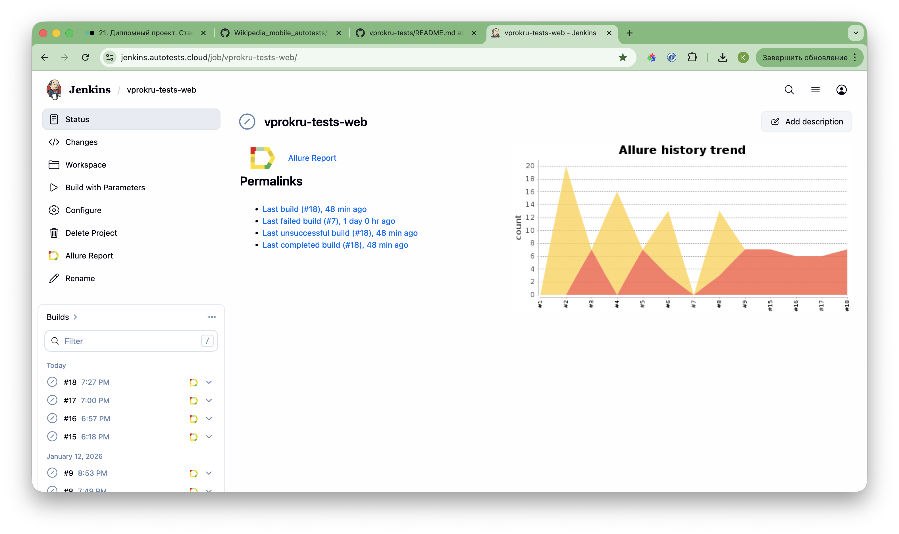
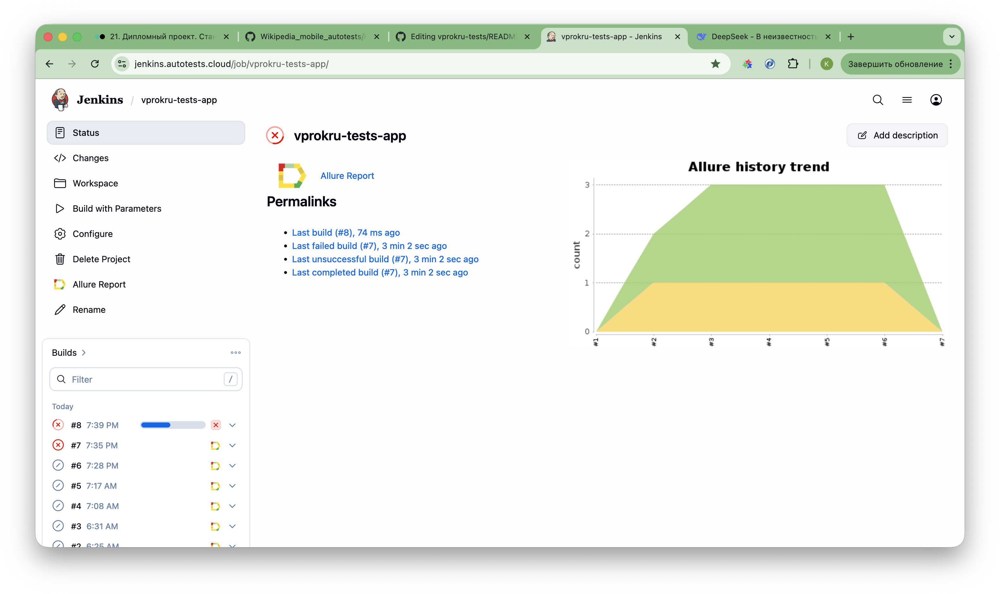
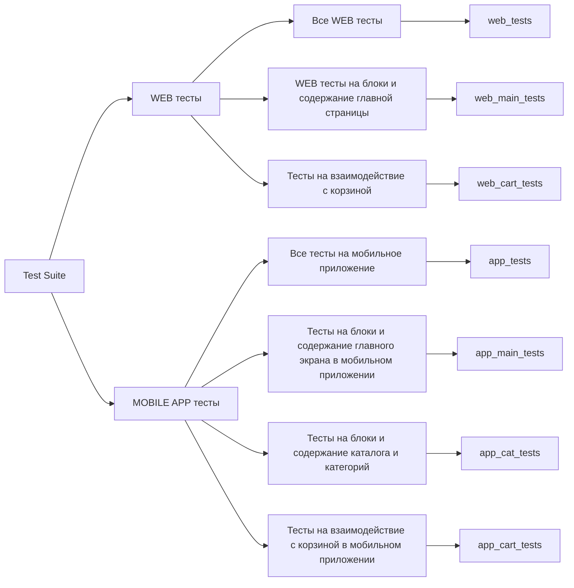
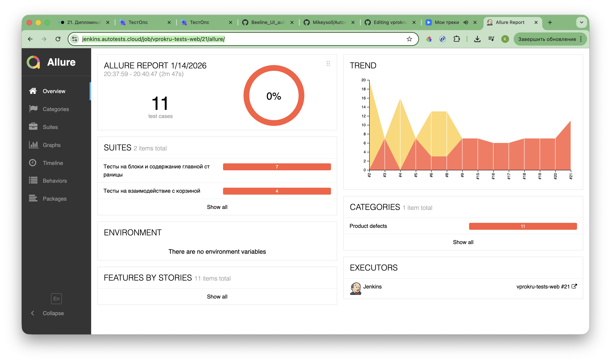
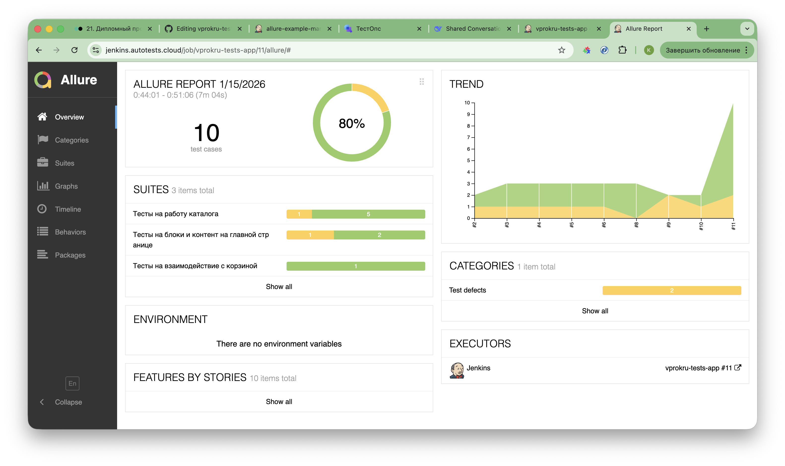
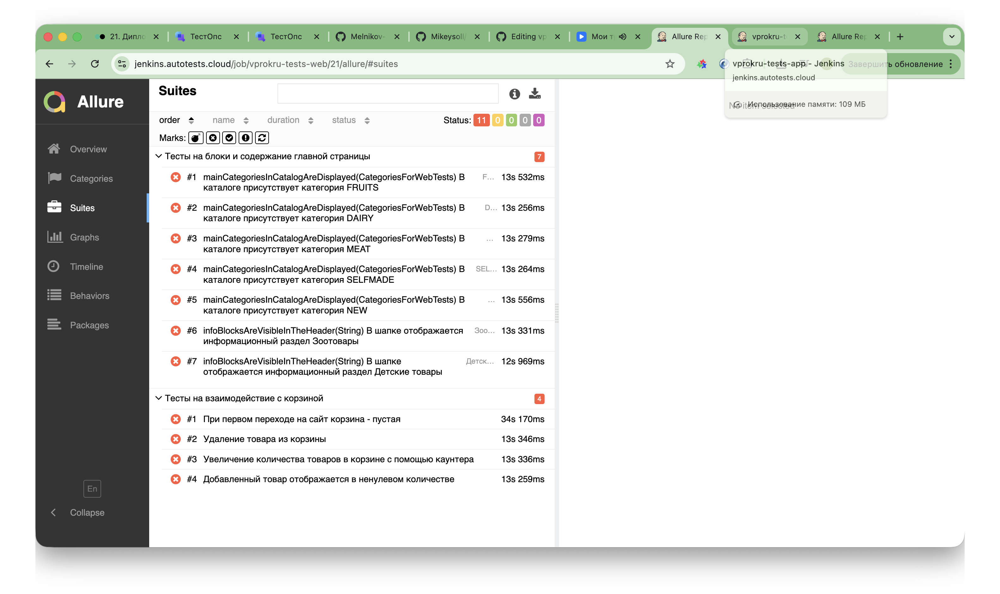
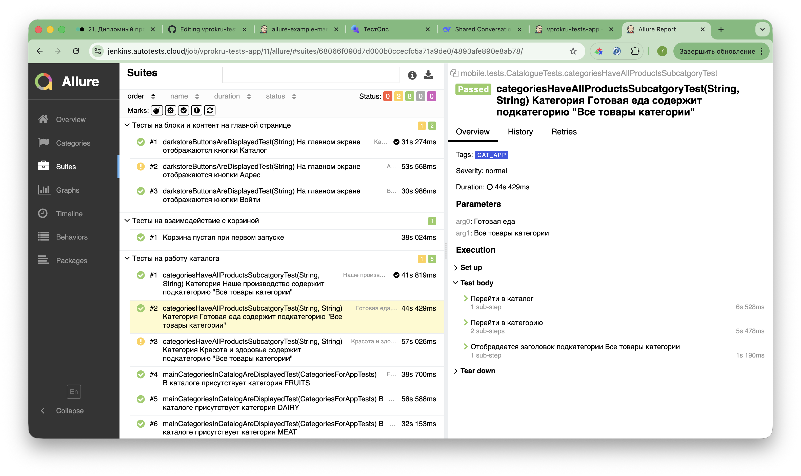
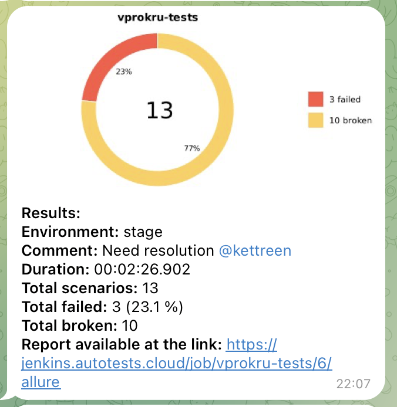

# 🛒 Проект по автоматизации тестирования для интернет-магазина Впрок (vprok.ru)

<p align="center"><a href="https://vprok.ru"></a></p>

> Впрок — это сервис доставки продуктов, предлагающий широкий ассортимент товаров по выгодным ценам с возможностью заказа через веб-сайт и мобильное приложение.

## 🧾 Содержание

<!-- Оглавление с внутренними ссылками на разделы -->
- [Технологии и инструменты](#-технологии-и-инструменты)
- [Тестовые сценарии](#-тестовые-сценарии)
- [Сборка в Jenkins](#-сборка-в-jenkins)
- [Команда для запуска](#-команда-для-запуска)
- [Allure отчет](#-allure-отчет)
- [Интеграция с Allure TestOps](#-интеграция-с-allure-testops)
- [Уведомления в Telegram](#-уведомления-в-telegram-чат-с-ботом)
- [Пример запуска тестов](#-видео-запуска-тестов)

## 🔨 Технологии и инструменты

<!-- Бейджи с технологиями -->
<p align="center">
  <!-- Badge для Java -->
  
  
  <!-- Badge для IntelliJ IDEA -->
  
  
  <!-- Badge для Gradle -->
  
  
  <!-- Badge для JUnit 5 -->
  
  
  <!-- Badge для Selenide -->
  
  
  <!-- Badge для Allure Report -->
  
  
  <!-- Badge для Jenkins -->
  
  
  <!-- Badge для Appium -->
  
  
  <!-- Badge для GitHub -->
  
</p>

<!-- Описание технологий -->
#### WEB
*   Тесты написаны на **Java** с использованием фреймворков **Selenide** (для WEB) и **Appium** (для мобильных тестов) с применением паттерна **Page Object/Page Component**.
*   **Gradle** используется в качестве системы сборки и управления зависимостями.
*   **JUnit 5** задействован как фреймворк для модульного тестирования, включая поддержку параметризованных тестов (`@ParameterizedTest`, `@EnumSource`, `@CsvSource`).
*   Для удаленного запуска мобильных тестов используется **Selenoid** (или аналог, например, BrowserStack).
*   Формирование наглядных отчетов выполняется с помощью **Allure Report**, с возможностью прикрепления скриншотов и видео.
*   Настройка непрерывной интеграции реализована в **Jenkins**.

#### MOBILE APP

- Тесты в данном проекте написаны на языке <code>Java</code> с использованием фреймворка для тестирования [Selenide](https://selenide.org/), c применением паттерна Page Object.
- Сборщик - <code>Gradle</code>.
- <code>JUnit 5</code> задействован в качестве фреймворка модульного тестирования.
- При прогоне тестов для запуска используется [Android Studio](https://developer.android.com/), [Browserstack](https://www.browserstack.com/), драйвер Appium.
- В отчетах Allure для каждого теста (запускаемого удаленно) прикреплено видео прохождения теста.

---

## 📋 Тестовые сценарии

### 🌐 Веб-приложение (WEB)
<!-- WEB тесты -->
*   ✅ **Главная страница**
    *   Логотип отображается и ведет на главную страницу при клике.
    *   Кнопка входа/регистрации отображается и кликабельна.
    *   В шапке отображаются информационные разделы: "Зоотовары", "Детские товары", "Красота и здоровье", "О доставке".
    *   В поисковом запросе отображается карточка искомого товара.
    *   Можно изменить город через селектор.
*   ✅ **Каталог товаров**
    *   Отображение основных категорий товаров.
*   ✅ **Корзина покупок**
    *   Корзина пуста при первом переходе на сайт.
    *   Добавленный в корзину товар отображается в ненулевом количестве.
    *   Увеличение количества товаров в корзине с помощью каунтера.
    *   Удаление товара из корзины.

### 📱 Мобильное приложение (APP)
<!-- APP тесты -->
*   ✅ **Главный экран**
    *   Отображение кнопок даркстора ("Каталог", "Адрес", "Войти").
*   ✅ **Каталог в приложении**
    *   Отображение плиток с категориями товаров в каталоге.
    *   Проверка структуры внутренних категорий.
*   ✅ **Корзина в приложении**
    *   Проверка состояния пустой корзины при первом запуске.

##  Сборка в Jenkins

В Jenkins отдельно реализованы сборки для WEB тестов и тестов мобильного приложения. 

#### [WEB JENKINS](https://jenkins.autotests.cloud/job/vprokru-tests-web/) 
<p align="center">

</p>

#### [MOBILE APP JENKINS](https://jenkins.autotests.cloud/job/vprokru-tests-app/) 
<p align="center">

</p>

### Параметры сборки проекта
<!-- Таблица параметров Jenkins -->
Для запуска сборки необходимо перейти в раздел `Собрать с параметрами`, выбрать необходимые параметры и нажать кнопку `Собрать`.
#### WEB
| Параметр | Назначение | Пример значения |
| :--- | :--- | :--- |
| `BROWSER` | Браузер для запуска | `chrome`, `safari` |
| `RESOLUTION` | Разрешение экрана | `x * y` |
| `FARM_LINK` | Удаленный сервер для запуска тестов | `selenoid.autotests.cloud` |
| `VERSION` | Версия браузера | `128.0`, `127.0`, `125.0`, `124.0` |
| `COMMENT` | Комментарий к запуску | Тег дежурного |
| `ENVIRONMENT` | Тестовая среда | `dev`, `stage`, `prod` |
| `TESTPACK`| Набор тестов для запуска| `web_tests`, `web_main_tests`, `web_cart_tests`|

#### MOBILE APP
| Параметр | Назначение | 
| :--- | :--- |
| `BrowserstackUserName` | login вашей УЗ в BrowserStack |
| `BrowserstackPassword` | Пароль вашей УЗ в BrowserStack | 
| `COMMENT` | Комментарий к запуску | 
| `TESTPACK`| Набор тестов для запуска| `app_tests`, `app_main_tests`, `app_cat_tests`, `app_cart_tests`|

---

## 🚀 Команда для запуска
#### WEB
Удаленный запуск с использованием Jenkins и Selenoid (требуется логин и пароль):
```bash  
./gradlew clean web_tests
-Denv=remoteweb
-Dbrowser=${BROWSER}
-Dversion=${VERSION}
-Dresolution=${RESOLUTION}
-Dfarm_link=https://user1:1234@${FARM_LINK}/wd/hub
```
Локальный запуск
```bash  
gradle clean web_tests 
```
#### MOBILE APP
Удаленный запуск с использованием BrowserStack (требуется логин и пароль):
```bash  
./gradlew clean app_tests
-Ddd=REMOTE
-Dbrowserstack.user=${BrowserstackUserName} - логин
-Dbrowserstack.key=${BrowserstackPassword} - пароль
```
Локальный запуск
> Для локального запуска тестов требуются следующие установленные программы на компьютере: Appium Server, Appium и Android Studio
```bash  
gradle clean app_tests 
```
---
### Варианты запуска тестов

Для запуска можно выбрать один из тест-сьютов:


---

После выполнения сборки, в блоке История сборок напротив номера сборки появится значок Allure Report, при клике на которые откроется страница со сформированным html-отчетом и тестовой документацией соответственно.

##  [Allure WEB](https://jenkins.autotests.cloud/job/vprokru-tests-web/21/allure/) отчет и [Allure APP](https://jenkins.autotests.cloud/job/vprokru-tests-app/8/allure/#) отчет

### 🖨️ Главная страница отчета
#### WEB
<p align="center">

</p>

#### APP
<p align="center">

</p>

### 📄 Тест-кейсы
#### WEB
<p align="center">

</p>

#### APP
<p align="center">

</p>

---

<a id="allure"></a>
##  </a>Интеграция с <a target="_blank" href="">Allure TestOps</a>
На *Dashboard* в <code>Allure TestOps</code> видна статистика количества тестов: сколько из них добавлены и проходятся вручную, сколько автоматизированы. Новые тесты, а так же результаты прогона приходят по интеграции при каждом запуске сборки.

## 🖨️ Основная страница отчёта

<p align="center">  
  
</p>  

## 📄 Авто и Ручные тест-кейсы

<p align="center">  
  
</p>

---

##  Уведомления в Telegram чат с ботом

После завершения сборки специальный бот, созданный в <code>Telegram</code>, автоматически обрабатывает и отправляет сообщение с отчетом о прогоне тестов.

### Уведомление из переписки с чат ботом


<p align="center">

</p>


#### Содержание уведомления в Telegram

- :heavy_check_mark: Окружение
- :heavy_check_mark: Комментарий
- :heavy_check_mark: Длительность прохождения тестов
- :heavy_check_mark: Общее количество сценариев
- :heavy_check_mark: Процент прохождения тестов
- :heavy_check_mark: Ссылка на Allure отчет

---
## Видео запуска WEB тестов
В отчетах Allure для каждого WEB теста прикреплен не только скриншот, но и видео прохождения теста
<p align="center">

</p>

## Видеопример выполнения APP теста
<p align="center">

</p>
